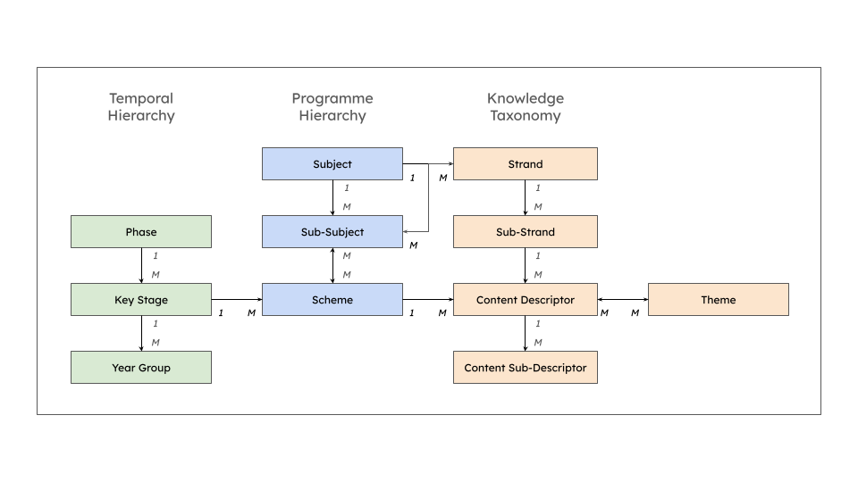

# DfE Curriculum Ontology

A semantic web ontology for describing curriculum structures, content organization, and educational programmes. Currently provides comprehensive coverage of the National Curriculum for England.

## Quick Start

```turtle
@prefix curric: <https://w3id.org/uk/curriculum/core/> .
@prefix eng: <https://w3id.org/uk/curriculum/england/> .

# Access Science content for Key Stage 3
eng:scheme-science-key-stage-3
  curric:hasContent eng:content-descriptor-cells-as-unit-of-living-organism .
```

**Namespace URIs:**
- DfE Curriculum Ontology: `https://w3id.org/uk/curriculum/core/`
- National Curriculum for England Data: `https://w3id.org/uk/curriculum/england/`

## Namespace Strategy

**⚠️ IMPORTANT: The current w3id.org namespaces are TEMPORARY.**

This ontology currently uses w3id.org URIs for development and initial deployment. However, the ultimate production architecture will use organization-owned namespaces with clear ownership boundaries.

### Ultimate Vision

**Department for Education (DfE)** will own and maintain the core curriculum standard at:
- **curriculum.education.gov.uk** - Core ontology and reference data

This namespace will contain:
- Core classes: Subject, KeyStage, Phase, Programme, Scheme
- Core properties: hasSubject, hasKeyStage, isPartOf
- Reference data: Official subjects, key stages, phases

**DfE's commitment:**
- URI persistence (like legislation.gov.uk)
- Professional infrastructure and governance
- Content negotiation (HTML for humans, RDF for machines)
- Stable versioning and documentation

### Why Not w3id.org Long-Term?

**Clear Ownership**: The DfE wholly owns and maintains the national curriculum standard. Using curriculum.education.gov.uk makes ownership explicit from the URI itself.

**No Governance Complexity**: There's no need for shared namespace coordination. DfE publishes the standard. Other organizations extend it in their own namespaces. This is a standard producer/consumer pattern, not a multi-stakeholder collaboration.

**Infrastructure Control**: DfE controls their own infrastructure, persistence policies, and service levels without dependency on external services.

**Professional Trust**: A .gov.uk domain provides immediate trust and authority for an official government standard.

### The Schema.org Pattern

This architecture follows the established pattern used by Schema.org:
- **Schema.org** maintains the core vocabulary at schema.org
- **Extensions** exist in their own namespaces (health-lifesci.schema.org, bib.schema.org)
- **External adopters** use their own domains and link to the core

The DfE curriculum standard works the same way: DfE owns the core, others extend and implement in their own namespaces.

### Standard Semantic Web Linking

Other organizations will extend the DfE standard in their own namespaces using standard OWL linking patterns:
- Import the DfE ontology
- Extend with organization-specific classes
- Link to DfE reference data

This approach:
- Makes ownership clear from URIs
- Eliminates coordination overhead
- Allows each organization to move at their own pace
- Follows established semantic web best practices

### Current State

During development and initial deployment, w3id.org provides:
- Quick setup without infrastructure requirements
- Content negotiation for testing
- Flexibility to iterate

These temporary URIs will be migrated to curriculum.education.gov.uk once DfE infrastructure is in place.

## Purpose

This ontology provides a standardized, machine-readable representation of the National Curriculum for England. It enables:

- **Interoperability**: Share curriculum data across educational platforms and systems
- **Semantic queries**: Discover content relationships, dependencies, and cross-cutting themes
- **Validation**: Ensure curriculum data quality through SHACL constraints
- **Linked data**: Connect curriculum content to other educational resources and standards

Designed to be reusable across England, Wales, Scotland, and Northern Ireland, though currently focused on the National Curriculum for England.

## Core Concepts

The ontology organizes curriculum data into three main hierarchies:

### 1. Temporal Hierarchy
Defines the age-based progression through the education system:
```
Phase (Primary, Secondary)
  └─ KeyStage (KS1, KS2, KS3, KS4)
      └─ YearGroup (Year 1-11)
```

### 2. Programme Hierarchy
Defines how subjects are organized and delivered:
```
Subject (e.g. Science)
  └─ SubSubject (e.g. Biology)
      └─ Scheme (e.g. Biology Key Stage 3)
```
A **Scheme** connects temporal and knowledge hierarchies by specifying which content descriptors are taught at which key stage.

### 3. Knowledge Taxonomy
Organizes the actual curriculum content and concepts:
```
Subject (e.g., Science)
  └─ Strand (e.g. Structure and function of living organisms)
      └─ SubStrand (e.g. Cells and organisation)
          └─ ContentDescriptor (e.g. Cells as the fundamental unit of living organisms)
              └─ ContentSubDescriptor (further detail, elaboration, examples)
```

### Cross-Cutting Themes
**Themes** provide connections across subjects (e.g., Climate Change, Digital Literacy) and can be linked to any content descriptor to show where these important topics appear throughout the curriculum.



## Quick Example 

Find all science content for Year 7 students:

```sparql
PREFIX curric: <https://w3id.org/uk/curriculum/core/>
PREFIX eng: <https://w3id.org/uk/curriculum/england/>

SELECT ?content ?label WHERE {
  ?scheme curric:hasKeyStage eng:key-stage-3 ;
          curric:hasContent ?content .
  ?content skos:prefLabel ?label .
}
```

See [docs/examples.md](docs/examples.md) for more SPARQL query examples.

## File Structure

```
dfe-curriculum-ontology/
├── ontology/
│   ├── curriculum-ontology.ttl           # Core classes and properties
│   ├── curriculum-constraints.ttl        # SHACL validation shapes
│   └── versions/                         # Versioned releases
├── data/
│   └── england/
│       ├── programme-structure.ttl       # Phases, Key Stages, Year Groups
│       ├── themes.ttl                    # Cross-cutting Themes
│       └── subjects/
│           └── science/
│               ├── science-subject.ttl                 # Subjects, Sub-Subjects
│               ├── science-knowledge-taxonomy.ttl      # Strands, Sub-Strands, ContentDescriptors
│               └── science-schemes.ttl                 # Schemes
│
├── distributions/                        # Distribution packages
├── docs/                                 # Documentation
├── tools/                                # Utility scripts
└── validation/                           # Test data and examples
```

## How to Use

### Direct URI Access

Once published, URIs will resolve via content negotiation:
- `https://w3id.org/uk/curriculum/core/Phase` - Class definition
- `https://w3id.org/uk/curriculum/england/key-stage-3` - KS3 data

### Load into a Triple Store

Load TTL files into any RDF triple store ([Apache Jena](https://jena.apache.org/), [GraphDB](https://graphdb.ontotext.com/), [Blazegraph](https://blazegraph.com/)):

```bash
# Example with Jena TDB2
tdb2.tdbloader --loc=/path/to/database ontology/*.ttl data/**/*.ttl
```

### Validate Data with SHACL

```bash
./tools/validate.sh data/england/subjects/science/*.ttl
```

See [docs/validation.md](docs/validation.md) for validation details.

### Query with SPARQL

```bash
# Example with Apache Jena
sparql --data=data/england/*.ttl --query=your-query.rq
```

See [docs/examples.md](docs/examples.md) for query patterns.

## Deployment

### Production SPARQL Endpoint

A public SPARQL endpoint is available at:
`https://national-curriculum-for-england-sparql-6336353060.europe-west1.run.app/national-curriculum-for-england/sparql`

### Deploy Your Own Instance

```bash
./deployment/deploy.sh
```

See [deployment/DEPLOY.md](deployment/DEPLOY.md) for detailed deployment instructions, monitoring, and troubleshooting.

## Using the Data

### Option 1: Download JSON Files

Pre-generated JSON files are available from GitHub Releases:

```bash
# Download latest release artifacts
# Visit: https://github.com/oaknational/uk-curriculum-ontology/releases/latest

# Download full curriculum dataset
curl -L https://github.com/oaknational/uk-curriculum-ontology/releases/latest/download/curriculum-full.json

# Download subjects index
curl -L https://github.com/oaknational/uk-curriculum-ontology/releases/latest/download/subjects-index.json
```

### Option 2: SPARQL Endpoint

Query the live SPARQL endpoint:

```bash
curl -X POST \
    -H "Content-Type: application/sparql-query" \
    -H "Accept: application/json" \
    --data "SELECT * WHERE { ?s ?p ?o } LIMIT 10" \
    https://national-curriculum-for-england-sparql-6336353060.europe-west1.run.app/national-curriculum-for-england/sparql
```

**Endpoint:** `https://national-curriculum-for-england-sparql-6336353060.europe-west1.run.app/national-curriculum-for-england/sparql`

See [docs/examples.md](docs/examples.md) for query examples.

### Option 3: Build from Source

```bash
# Clone repository
git clone https://github.com/oaknational/uk-curriculum-ontology.git
cd uk-curriculum-ontology

# Generate JSON files
./scripts/build-static-data.sh

# Output: distributions/**/*.json
```

## For Developers

### Building

See [BUILD.md](BUILD.md) for build instructions.

### Deployment

See [deployment/DEPLOY.md](deployment/DEPLOY.md) for deployment guide.

### Releases

See [RELEASE.md](RELEASE.md) for release process.

### Architecture

See [ARCHITECTURE.md](ARCHITECTURE.md) for complete architecture documentation.

## API Documentation

### JSON API

Generated JSON files follow SPARQL JSON Results Format:

```json
{
  "results": {
    "bindings": [
      {
        "contentId": { "type": "literal", "value": "..." },
        "label": { "type": "literal", "value": "..." },
        "definition": { "type": "literal", "value": "..." }
      }
    ]
  }
}
```

### SPARQL API

**Endpoint:** `https://national-curriculum-for-england-sparql-6336353060.europe-west1.run.app/national-curriculum-for-england/sparql`

**Query:**
```sparql
PREFIX curric: <https://w3id.org/uk/curriculum/core/>
PREFIX eng: <https://w3id.org/uk/curriculum/england/>
PREFIX skos: <http://www.w3.org/2004/02/skos/core#>

SELECT * WHERE {
  ?subject a curric:Subject ;
           rdfs:label ?label .
}
```

**Example (curl):**
```bash
curl -X POST \
    -H "Content-Type: application/sparql-query" \
    -H "Accept: application/json" \
    --data-binary @query.sparql \
    https://national-curriculum-for-england-sparql-6336353060.europe-west1.run.app/national-curriculum-for-england/sparql
```

## Cost

**Monthly Operating Cost:** ~$10-30
- Static JSON hosting: Free (GitHub Releases)
- SPARQL endpoint: $10-30 (Google Cloud Run, scales to zero)
- Minimal cost with low usage due to automatic scaling

## Versioning

This ontology follows [Semantic Versioning](https://semver.org/):
- **Major** (1.0.0): Breaking changes to class/property definitions
- **Minor** (0.1.0): New classes, properties, or data (backward compatible)
- **Patch** (0.0.1): Bug fixes, corrections (backward compatible)

Current version: **0.1.0**

Each version is preserved in `versions/` directories with dated IRIs. See [CHANGELOG.md](CHANGELOG.md) for version history.

## Standards Used

- **RDF 1.1**: [W3C Recommendation](https://www.w3.org/TR/rdf11-primer/)
- **OWL 2**: [W3C Recommendation](https://www.w3.org/TR/owl2-overview/)
- **SKOS**: [W3C Recommendation](https://www.w3.org/TR/skos-reference/) for taxonomies
- **SHACL**: [W3C Recommendation](https://www.w3.org/TR/shacl/) for validation
- **Dublin Core**: Metadata terms ([DCMI](https://www.dublincore.org/specifications/dublin-core/dcmi-terms/))

## Documentation

- [Conceptual Model](docs/model.md) - Detailed class and property descriptions
- [SPARQL Examples](docs/examples.md) - Practical query patterns
- [Validation Guide](docs/validation.md) - SHACL constraints and validation
- [Extension Guide](docs/extending.md) - How to add new content

## License

This work is made available under the [Open Government Licence v3.0](http://www.nationalarchives.gov.uk/doc/open-government-licence/version/3/).

Crown Copyright (c) 2025

## Support

For questions or issues:
- Open an issue: https://github.com/oaknational/uk-curriculum-ontology/issues
- Email: curriculum@education.gov.uk

## Related Resources

- [National Curriculum for England](https://www.gov.uk/government/collections/national-curriculum)
- [UK Government Linked Data](https://www.data.gov.uk/)
